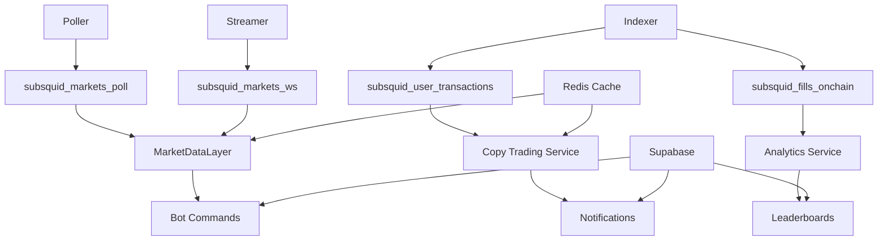

# 🔄 Architecture des Services de Data Ingestion

**Date:** Novembre 2025
**Version:** 1.0
**Auteur:** Senior Software Engineer

---

## 📋 Vue d'ensemble

Ce document analyse en détail les **3 services principaux de data ingestion** : Poller, Streamer et Indexer Subsquid. Pour chaque service, nous examinerons :

- 🎯 **Setup & Configuration**
- 🔗 **Relations** avec bot, Redis, Supabase
- 💡 **Utilité** et cas d'usage
- ❌ **Critiques** et points faibles
- 🔧 **Améliorations** proposées

---

## 🔄 1. POLLER SERVICE - Polling Gamma API

### 🎯 **Setup & Configuration**

#### **Architecture Technique**
```python
# data-ingestion/src/config.py
class Settings:
    POLLER_ENABLED = os.getenv('POLLER_ENABLED', 'true').lower() == 'true'
    POLL_MS = int(os.getenv('POLL_MS', '60000'))  # 60 secondes
    POLL_RATE_LIMIT_BACKOFF_MAX = 300  # 5 minutes max backoff
    GAMMA_API_URL = "https://gamma-api.polymarket.com"
    EXPERIMENTAL_SUBSQUID = os.getenv('EXPERIMENTAL_SUBSQUID', 'true').lower() == 'true'
```

#### **Démarrage & Cycle**
```python
# data-ingestion/src/polling/poller.py
async def start(self):
    """Boucle principale de polling"""
    while True:
        await self.poll_cycle()
        await asyncio.sleep(settings.POLL_MS / 1000.0)
```

#### **Approche Hybride (2 Passes)**
```python
# PASS 1: /events endpoint (marchés groupés)
events = await self._fetch_events(offset, limit)  # Données complètes
for event in events:
    markets = event.get("markets", [])
    enriched = self._enrich_market_from_event(market, event)

# PASS 2: /markets endpoint (marchés manqués)
standalone = await self._fetch_markets()  # Individuel si pas couvert
```

### 🔗 **Relations avec le Système**

#### **Avec le Bot**
```
Poller → MarketDataLayer → Bot Commands (/markets, /positions)
    ↓
subsquid_markets_poll → Redis Cache → UI Response
```

#### **Avec Redis**
```python
# Cache les données enrichies
redis_cache.cache_markets_page(filter_name, page, markets, ttl=600)

# TTL: 10 minutes pour marchés (changement lent)
```

#### **Avec Supabase**
```sql
-- Table principale
CREATE TABLE subsquid_markets_poll (
    market_id TEXT PRIMARY KEY,
    outcomes TEXT[],
    outcome_prices NUMERIC(8,4)[],
    events JSONB,  -- Métadonnées d'événements
    updated_at TIMESTAMPTZ DEFAULT now()
);
```

### 💡 **Utilité & Cas d'Usage**

#### **Rôle Principal**
- **Source de vérité** pour métadonnées marchés (questions, outcomes, volumes)
- **Données enrichies** avec events, catégories, tokens
- **Fallback fiable** quand WebSocket indisponible

#### **Cas d'Usage**
- ✅ **/markets command** - Liste complète des marchés
- ✅ **Market details** - Informations complètes sur un marché
- ✅ **Analytics** - Statistiques de volume/liquidité
- ✅ **Search** - Indexation pour recherche par titre/catégorie

### ❌ **Critiques & Points Faibles**

#### **Performance**
- ❌ **60s minimum latency** - Pas temps réel
- ❌ **ETag caching limité** - Re-télécharge souvent
- ❌ **2 passes séparées** = complexité + overhead

#### **Fiabilité**
- ❌ **Race conditions** entre PASS 1 et PASS 2
- ❌ **Categorizer AI cassé** (désactivé = perte fonctionnalité)
- ❌ **Backoff agressif** bloque ingestion pendant erreurs

#### **Maintenance**
- ❌ **Code volumineux** (1800+ lignes)
- ❌ **Configuration fragmentée** (env vars partout)
- ❌ **Monitoring limité** (pas de métriques détaillées)

### 🔧 **Améliorations Proposées**

#### **Priorité Haute**
1. **Single Pass Optimization**
   ```python
   # Nouveau: Query optimisée combinant events + marchés
   async def poll_unified(self):
       # Une seule requête pour tout couvrir
       # Élimine race conditions
   ```

2. **Intelligent Caching**
   ```python
   # Cache différentiel basé sur changement
   if market_changed_since_last_poll:
       await update_cache(market_id)
   ```

3. **Monitoring Complet**
   ```python
   # Métriques Prometheus
   POLLER_SUCCESS = Counter('poller_success', ['endpoint', 'status'])
   POLLER_LATENCY = Histogram('poller_latency', ['operation'])
   ```

#### **Priorité Moyenne**
4. **Configuration Centralisée**
   ```python
   # Config as code au lieu d'env vars
   class PollerConfig:
       endpoints = ['/events', '/markets']
       ttl_by_data_type = {'markets': 600, 'events': 300}
   ```

5. **Error Recovery Intelligent**
   ```python
   # Retry avec circuit breaker par endpoint
   @circuit_breaker(endpoint='/events')
   async def fetch_events_safe(self):
       pass
   ```

---

## 🌐 2. STREAMER SERVICE - WebSocket Temps Réel

### 🎯 **Setup & Configuration**

#### **Connexion WebSocket**
```python
# data-ingestion/src/config.py
CLOB_WSS_URL = "wss://ws-subscriptions-clob.polymarket.com"
WS_RECONNECT_BACKOFF_MAX = 300  # 5 minutes
STREAMER_ENABLED = os.getenv('STREAMER_ENABLED', 'true').lower() == 'true'
```

#### **Souscriptions Dynamiques**
```python
# Refresh automatique des souscriptions
self.subscription_refresh_interval = 60  # Toutes les 60s
self.subscription_refresh_task = asyncio.create_task(
    self._periodic_subscription_refresh()
)
```

#### **Gestion des Messages**
```python
# Types de messages supportés
MESSAGE_TYPES = {
    'snapshot': self._handle_orderbook_snapshot,
    'delta': self._handle_orderbook_delta,
    'trade': self._handle_trade_update
}
```

### 🔗 **Relations avec le Système**

#### **Avec le Bot**
```
Streamer → subsquid_markets_ws → MarketDataLayer.get_live_price()
    ↓
/positions refresh → Prix temps réel (best_bid/ask/mid)
    ↓
UI updates instantanées
```

#### **Avec Redis**
```python
# Cache ultra-court pour fraîcheur maximale
redis_cache.cache_token_price(token_id, price, ttl=20)  # 20 secondes

# Pas de cache long - données trop volatiles
```

#### **Avec Supabase**
```sql
-- Table temps réel
CREATE TABLE subsquid_markets_ws (
    market_id TEXT PRIMARY KEY,
    last_bb NUMERIC(8,4),     -- Best bid
    last_ba NUMERIC(8,4),     -- Best ask
    last_mid NUMERIC(8,4),    -- Mid price calculé
    last_trade_price NUMERIC(8,4),
    updated_at TIMESTAMPTZ DEFAULT now()
);
```

### 💡 **Utilité & Cas d'Usage**

#### **Rôle Principal**
- **Prix temps réel** pour trading actif
- **Orderbook live** pour décisions trading
- **Trades instantanés** pour monitoring

#### **Cas d'Usage**
- ✅ **Trading actif** - Prix up-to-date pour décisions
- ✅ **Positions monitoring** - Valeur portefeuille temps réel
- ✅ **Arbitrage** - Détection écarts prix
- ✅ **Alertes prix** - Notifications quand seuils atteints

### ❌ **Critiques & Points Faibles**

#### **Fiabilité**
- ❌ **Connexion fragile** - Dépend du réseau
- ❌ **Auto-reconnexion complexe** (backoff + jitter)
- ❌ **Pas de persistence** - Données perdues au restart

#### **Performance**
- ❌ **Souscriptions dynamiques** = overhead réseau continu
- ❌ **Parsing CPU intensif** - Chaque message traité individuellement
- ❌ **Memory leaks** potentiels avec reconnexions fréquentes

#### **Observabilité**
- ❌ **Logs verbeux** mais pas structurés
- ❌ **Pas de métriques** de performance (latence, throughput)
- ❌ **Debugging difficile** (WebSocket state invisible)

### 🔧 **Améliorations Proposées**

#### **Priorité Haute**
1. **Connection Pooling**
   ```python
   # Pool de connexions pour haute disponibilité
   class WebSocketPool:
       def __init__(self, urls: List[str]):
           self.connections = [WebSocketConnection(url) for url in urls]
   ```

2. **State Persistence**
   ```python
   # Sauvegarde état pour recovery rapide
   async def save_streamer_state(self):
       state = {
           'subscriptions': list(self.subscribed_markets),
           'last_message_ts': self.last_message_time
       }
       await redis_client.set('streamer_state', json.dumps(state))
   ```

3. **Batch Processing**
   ```python
   # Accumule updates avant DB write
   async def batch_upsert_prices(self, price_updates: Dict[str, float]):
       # Single bulk upsert au lieu de N individuels
       await db.bulk_update_prices(price_updates)
   ```

#### **Priorité Moyenne**
4. **Health Checks Avancés**
   ```python
   # Monitoring connexion + latence
   async def health_check(self):
       latency = await self.measure_latency()
       return {
           'connected': self.websocket is not None,
           'latency_ms': latency,
           'messages_per_sec': self.message_rate
       }
   ```

5. **Configuration Adaptive**
   ```python
   # Ajuste stratégie selon volatilité marché
   def adapt_refresh_rate(self, market_volatility: float):
       if market_volatility > 0.8:  # Marché volatile
           self.subscription_refresh_interval = 30  # Plus fréquent
       else:
           self.subscription_refresh_interval = 120  # Moins fréquent
   ```

---

## ⛓️ 3. INDEXER SUBSQUID - On-Chain Data

### 🎯 **Setup & Configuration**

#### **Configuration TypeScript**
```typescript
// indexer-ts/src/main.ts
const TRANSFER_SINGLE_TOPIC = '0xc3d58168c5ae7397731d063d5bbf3d657854427343f4c083240f7aacaa2d0f62'
const TRANSFER_BATCH_TOPIC = '0x4a39dc06d4c0dbc64b70af90fd698a233a518aa5d07ce33e6397d8d63df03e93'

// RPC Configuration
const rpcUrl = process.env.RPC_POLYGON_HTTP || 'https://polygon-rpc.com'
```

#### **Database Connection**
```typescript
// IPv4-first DNS pour Railway
setDefaultResultOrder('ipv4first')
process.env.NODE_OPTIONS += ' --dns-result-order=ipv4first'
```

#### **Webhook Setup**
```typescript
// indexer-ts/src/webhook-notifier.ts
const WEBHOOK_URL = process.env.WEBHOOK_URL
const WEBHOOK_SECRET = process.env.WEBHOOK_SECRET

// Copy trading addresses cache
const watched_cache = new WatchedAddressCache()
```

### 🔗 **Relations avec le Système**

#### **Avec le Bot**
```
Indexer → Webhook POST → Bot (copy trading)
    ↓
subsquid_user_transactions → Bot DB → Trading decisions
    ↓
Notifications temps réel aux utilisateurs
```

#### **Avec Redis**
```python
# Cache adresses surveillées
await redis_client.setex('watched_addresses:cache:v1', 300, json.dumps(data))

# Cache utilisé par indexer pour filtrage rapide
watched_addresses = await redis_client.get('watched_addresses:cache:v1')
```

#### **Avec Supabase**
```sql
-- Transactions on-chain
CREATE TABLE subsquid_user_transactions (
    id TEXT PRIMARY KEY,
    tx_id TEXT UNIQUE,
    user_address TEXT NOT NULL,
    market_id TEXT,
    outcome INTEGER,  -- 0=NO, 1=YES
    tx_type TEXT,     -- BUY or SELL
    amount NUMERIC(18,8),
    price NUMERIC(8,4),
    amount_in_usdc NUMERIC(18,6),  -- Confusion avec amount!
    tx_hash TEXT,
    block_number BIGINT,
    timestamp TIMESTAMPTZ,
    created_at TIMESTAMPTZ DEFAULT now()
);

-- Fills blockchain
CREATE TABLE subsquid_fills_onchain (
    fill_id TEXT PRIMARY KEY,
    market_id TEXT,
    user_address TEXT,
    outcome TEXT,
    amount NUMERIC(18,8),
    price NUMERIC(8,4),
    tx_hash TEXT,
    block_number BIGINT,
    timestamp TIMESTAMPTZ
);
```

### 💡 **Utilité & Cas d'Usage**

#### **Rôle Principal**
- **Source de vérité on-chain** pour transactions utilisateurs
- **Copy trading data** - Trades externes non trackés par le bot
- **Audit trail complet** des activités blockchain

#### **Cas d'Usage**
- ✅ **Copy trading externe** - Suivre traders hors plateforme
- ✅ **Smart wallet tracking** - Monitorer wallets identifiées
- ✅ **Fraud detection** - Vérifier cohérence on-chain/off-chain
- ✅ **Analytics avancés** - P&L réel basé blockchain

### ❌ **Critiques & Points Faibles**

#### **Architecture**
- ❌ **Webhook blocking** - Bloque indexer si HTTP fail
- ❌ **No retry logic** - Échec webhook = perte données
- ❌ **Memory intensive** - Tous transfers chargés en RAM

#### **Data Quality**
- ❌ **amount vs amount_in_usdc confusion** - Deux champs similaires
- ❌ **Type mismatches** - amount TEXT dans v2 vs NUMERIC dans v1
- ❌ **No data validation** - Payloads bruts stockés

#### **Maintenance**
- ❌ **Configuration IPv4 hack** - Solution temporaire
- ❌ **No monitoring** - Métriques limitées
- ❌ **TypeScript complexity** - Code difficile à maintenir

### 🔧 **Améliorations Proposées**

#### **Priorité Haute**
1. **Webhook Async & Retry**
   ```typescript
   // Queue non-blocking avec retry
   const webhookQueue = new WebhookQueue({
       retryAttempts: 3,
       backoffMs: 1000,
       deadLetterQueue: true
   })
   ```

2. **Data Validation**
   ```typescript
   // Schema validation avant stockage
   const transactionSchema = z.object({
       amount: z.number().positive(),
       price: z.number().min(0).max(1),
       amount_in_usdc: z.number().positive()
   })
   ```

3. **Memory Optimization**
   ```typescript
   // Streaming processing au lieu de load all
   const processor = new StreamingProcessor({
       batchSize: 100,
       memoryLimit: '512MB'
   })
   ```

#### **Priorité Moyenne**
4. **Dual RPC Endpoints**
   ```typescript
   // Haute disponibilité RPC
   const rpcEndpoints = [
       process.env.RPC_POLYGON_HTTP,
       'https://polygon-rpc.com',
       'https://polygon.llamarpc.com'
   ]
   ```

5. **Metrics & Monitoring**
   ```typescript
   // Métriques détaillées
   const indexerMetrics = {
       blocksProcessed: new Counter(),
       transactionsParsed: new Counter(),
       webhooksSent: new Counter(),
       errors: new Counter()
   }
   ```

---

## 🔄 4. RELATIONS ENTRE SERVICES

### **Flux de Données Complet**



### **Dépendances & Synchronisation**

#### **Temps Réel (Streamer)**
- **Dépendance**: Aucune - autonome
- **Impact failure**: Prix non temps réel, fallback poller
- **Recovery**: Auto-reconnexion (backoff + jitter)

#### **Batch (Poller)**
- **Dépendance**: Supabase healthy
- **Impact failure**: Métadonnées obsolètes
- **Recovery**: Retry avec backoff

#### **On-Chain (Indexer)**
- **Dépendance**: RPC Polygon + Supabase + Redis
- **Impact failure**: Copy trading arrêté
- **Recovery**: Restart indexer (state perdu)

---

## 📊 5. ANALYSE COMPARATIVE

| Aspect | Poller | Streamer | Indexer |
|--------|--------|----------|---------|
| **Latence** | 60s | <10ms | <5s |
| **Fiabilité** | Élevée | Moyenne | Élevée |
| **Complexité** | Élevée | Moyenne | Élevée |
| **Maintenance** | Difficile | Moyenne | Difficile |
| **Criticité** | Moyenne | Élevée | Élevée |

### **Recommandations Globales**

#### **🔴 Critique (Setup)**
1. **Configuration centralisée** - Un seul endroit pour tous les services
2. **Health checks unifiés** - Dashboard commun pour monitoring
3. **Error handling standardisé** - Patterns communs pour recovery

#### **🟡 Amélioration (Relations)**
1. **Service mesh** - Communication inter-services fiable
2. **Circuit breakers** - Protection contre cascading failures
3. **Metrics aggregation** - Observabilité unifiée

#### **🟢 Optimisation (Performance)**
1. **Resource pooling** - Partage connexions DB/Redis
2. **Batch operations** - Réduire nombre de queries
3. **Caching intelligent** - TTL adaptatif selon données

---

## 🎯 CONCLUSION

### **Points Forts**
- ✅ **Couverture complète** - Off-chain + on-chain
- ✅ **Temps réel possible** - Via WebSocket + webhooks
- ✅ **Résilience** - Fallbacks entre services

### **Risques Majeurs**
- ❌ **Complexité excessive** - Maintenance difficile
- ❌ **Dépendances cachées** - Services interconnectés
- ❌ **Monitoring insuffisant** - Debugging difficile

### **Priorités d'Amélioration**
1. **🔴 Simplifier architecture** - Réduire complexité
2. **🟡 Unifier configuration** - Setup centralisé
3. **🟢 Améliorer observabilité** - Monitoring complet

**Score Global: 6.5/10** - Architecture fonctionnelle mais nécessite simplification majeure.

---

*Document créé le 6 novembre 2025 - Analyse détaillée des services de data ingestion*
